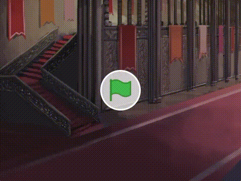

# 1. はじめに(Introduction)

このドキュメントでは、[Scratch 3.0](https://scratch.mit.edu/download)で音声合成、翻訳を使ったアニメーションの作成方法を説明します。

This document explains how to develop animations using speech synthesis and translation in [Scratch 3.0](https://scratch.mit.edu/download).

ドキュメント作成者：神長 貴博(NTTテクノクロス株式会社)

Document Author：Takahiro Jincho(NTT TechnoCross Corporation)

# 2. 準備(Preparation)
# 2-1. 準備①:開発環境(Preparation①:Development environment)

- [Scratch公式サイト(https://scratch.mit.edu/download)](https://scratch.mit.edu/download)から、Scratch 3.0をダウンロード、インストールする。(Scratch 3.0は、Windows、macOS、chromeOS、Androidに対応。(2020/04/13時点))

    Download and install Scratch 3.0 from the [Scratch official website(https://scratch.mit.edu/download)](https://scratch.mit.edu/download).(Scratch 3.0 is compatible with Windows, macOS, chromeOS, Android. (As of 2020/04/13))

- インターネットに接続していることを確認してください。

    Confirm connected to the Internet.

# 2-2. 準備②:拡張機能(Preparation②:Plugin)

- Scratch 3.0を起動後、をクリックしてください。

    After launching Scratch 3.0, click on .

- 音声合成と翻訳を追加してください。

    Add text-to-speech and translation.

- とが追加されていることを確認してください。

    Confirm that  and  are added.

# 3. 作り方(How to develop)

このゲームは、以下4つのプログラムで構成されています。

This game consists of the following four programs.

- ゴブリン(Goblin)
- フランク(Frank)
- ウィザード(Wizard)
- 背景(Background)

ここでは、各プログラムの作り方を説明します。

以下表のプログラム名をクリックすると、プログラムの説明が表示されます。

プログラムは **『ゴブリン→フランク→ウィザード→背景』** の順番で作成します。

In this section, i will explain how to make each program.

Click on a program name in the table below to see a description of the program.

Develop the program in the order of "Goblin -> Frank -> Wizard-> Background".

| プログラム名(Program name) | 概要(Overview) |
|:----|:----|
| [ゴブリン](goblin.md) | ゴブリンのプログラムの説明(Goblin's program description) |
| [フランク](frank.md) | フランクのプログラムの説明(Frank's program description) |
| [ウィザード](wizard.md)| ウィザードのプログラムの説明(Wizard's program description) |
| [背景](background.md) | 背景のプログラムの説明(Background program description) |

# 4. プログラムの保存方法(How to save the program)

Scrachのファイルのメニューから『コンピューターに保存する』を選択し、実行してください。

From the Scrach file menu, select "Save to computer" and run it.

# 5. プログラムの実行・停止方法(How to run and stop the program)

## 5-1. プログラムを実行(Run the program)

旗のボタンを押してください。

Press the flag button.

## 5-2. プログラムを停止(Stop the program)

赤いボタンを押してください。

Press the red button.

