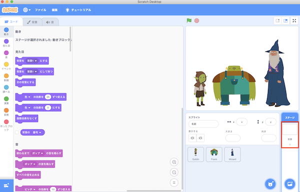
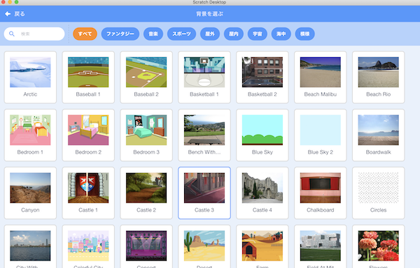
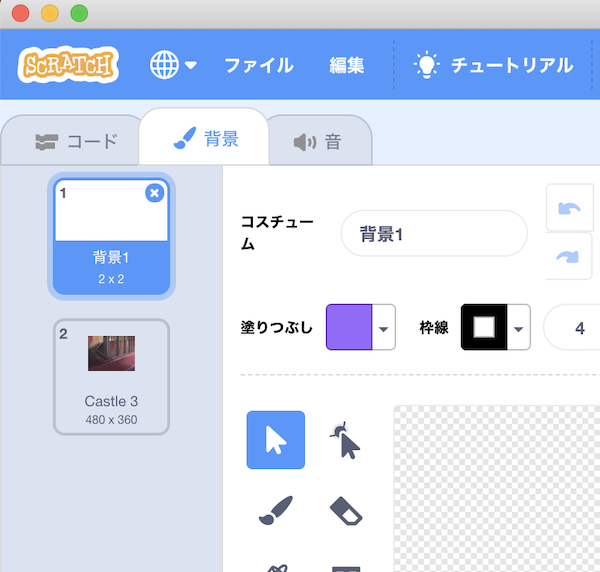

# 背景のプログラムの作り方(How to develop a background program)

## 1. プログラムの作り方(How to develop a program)

- 画面右下にある背景1をクリックします。

    Click on Background 1 at the bottom right of the screen.

- 背景のタブをクリックし、を押します。

    Click on the Background tab and press .

- 以下の画面が表示されるので、背景を選択します。(例：Castle3を選択。)

    The following screen will display and you can select a background. (For example, select Castle3.)

- 選んだ背景が追加されたことを確認後、『背景1』を選択し、右上の×ボタンを押して削除します。

    After confirming that the selected background has been added, select "Background 1" and press the x button at the top right to remove it.

- これでプログラムは完成です。

    The program is complete.

- 最後に、プログラムを保存してください。

    Finally, save the program.

