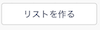
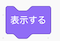
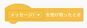

# ゴブリンのプログラムの作り方(How to develop a goblin program)

## 1. プログラムを作る前の準備(Preparation before develop the program)

- Scratch 3.0を起動し、スプライト1を削除してください。(スプライト1を選択→×をクリック)

    Start Scratch 3.0 and delete sprite 1.(Select sprite 1　→　Click ×)

- ボタンをクリックしてください。

    Click on the  button.

- ゴブリン(Goblin)を選択、クリックしてください。

    Select a goblin and click on it.

- スプライトが設定されていることを確認してください。

    Confirm that the selected sprite is set.

## 2. プログラムの作り方(How to develop a program)

### 2-1. 完成イメージ(Completed image)

### 2-2. 作り方(How to develop)

- を押してください。

    Press .

- を押してください。

    Press .

- 以下の画面が表示されるので、 **『ブロック名』を『ゴブリンの会話』に変更** してください。

    When the following screen is displayed, change the "Block Name" to "Goblin Conversation" and press the OK button.

- 『引数を追加(数値またはテキスト)』をクリックし、 **『number or text』を『ゴブリンのセリフ』に変更** 後、OKボタンを押してください。

    Click "Add argument (number or text)", change "number or text" to "Goblin's line", and then click OK.

- 以下の画面が表示されることを確認してください。

    Confirm that the following screen is displayed.

- 以下のブロックを画面中央にドラック＆ドロップします。

    Drag and drop the following blocks to the center of the screen.

 

 

 

- の **『こんにちは！』に**  をドラッグ＆ドロップしてください。

    Drag and drop the  into "Hello" in .

- の **『こんにちわ』に** をドラッグ＆ドロップしてください。

    Drag and drop the  into "Hello" in .

- の▼ボタンを押し、表示される言語の一覧から **『英語』を選んでください** 。

    Press the ▼ button on A and select "English" from the list of languages displayed.

- の『hello』にをドラッグ＆ドロップしてください。

    Drag and drop  to "hello" in .

- ブロックをくっつけてください。

    Connect the blocks.

- を押してください。

    Press .

- を押してください。

    Press .

- **『新しいリスト名：』に『ゴブリンの会話』と入力** 後、 **『このスプライトのみ』** を選択してOKボタンを押してください。

    Enter "Goblin Conversation" in the "New List Name:" field, then select "This Sprite Only" and click OK.

- 空のリストが画面上に表示されることを確認してください。

    Confirm that the blank list display on the screen.

- リストの＋ボタンを押し、 **『おはよう』と『宿題やった？』と『はーい。』を設定** してください。

Press the + button on the list and set the "Good morning" and "Did you do your homework?" and "Yes" settings.

- 以下のブロックを画面中央にドラック＆ドロップします。

    Drag and drop the following blocks to the center of the screen.

  

  

  

 

 

- にをドラック＆ドロップしてください。

    Drag and drop  to .

- の▼ボタンを押し、表示されるコスチュームの一覧から **『goblin-b』を選んでください** 。

    Press ▼ on  and select "goblin-b" from the list of costumes that display.

- ブロックをくっつけてください。

    Connect the blocks.

- 以下のブロックを画面中央にドラック＆ドロップします。

    Drag and drop the following blocks to the center of the screen.

 

  

 

 

- にをドラック＆ドロップしてください。

    Drag and drop  to .

- の数字を **2に変更** します。(数字をダブルクリックすることで、数字を編集できる状態になります。)

    Change the number  to 2. (Double-clicking on a number, you will be able to edit the number.)

- の▼ボタンを押して **『新しいメッセージ』** を選択し、以下の画面が表示されることを確認してください。

    Press ▼ on  to select "New Message" and confirm that the following screen is displayed.

- **『新しいメッセージ名』** に **『メッセージ2』** と入力し、OKボタンを押してください。

    Enter "Message 2" in the "New Message Name" field and press the OK button.

- の▼ボタンを押して **『新しいメッセージ』** を選択し、以下の画面が表示されることを確認してください。

    Press ▼ on  to select "New Message" and confirm that the following screen is displayed.

- **『新しいメッセージ名』** に **『メッセージ3』** と入力し、OKボタンを押してください。

    Enter "Message 3" in the "New Message Name" field and press the OK button.

- ブロックをくっつけてください。

    Connect the blocks.

- 以下のブロックを画面中央にドラック＆ドロップします。

    Drag and drop the following blocks to the center of the screen.

  

 

 

 

 

- にをドラック＆ドロップしてください。

    Drag and drop  to .

- の数字を **3に変更** します。(数字をダブルクリックすることで、数字を編集できる状態になります。)

    Change the number  to 3. (Double-clicking on a number, you will be able to edit the number.)

- の▼ボタンを押して **『新しいメッセージ』** を選択し、以下の画面が表示されることを確認してください。

    Press ▼ on  to select "New Message" and confirm that the following screen is displayed.

- **『新しいメッセージ名』** に **『メッセージ5』** と入力し、OKボタンを押してください。

    Enter "Message 2" in the "New Message Name" field and press the OK button.

- の▼ボタンを押し、表示されるコスチュームの一覧から **『goblin-b』を選んでください** 。

    Press ▼ on  and select "goblin-b" from the list of costumes that display.

- ブロックをくっつけてください。

    Connect the blocks.

- 最後に、プログラムを保存してください。

    Finally, save the program.

