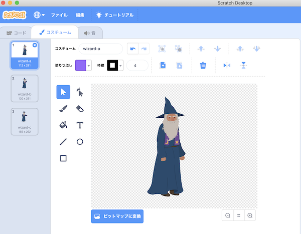
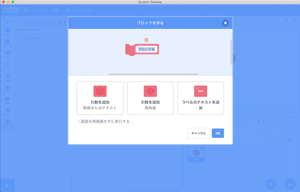
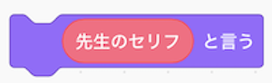
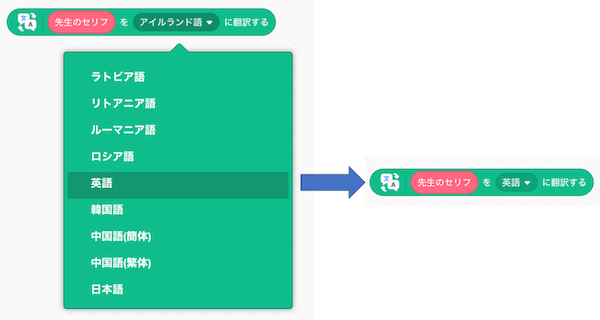
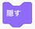
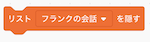
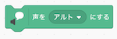
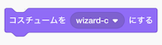

# ウィザードのプログラムの作り方(How to develop a wizard program)

## 1. プログラムを作る前の準備(Preparation before develop the program)

- ボタンをクリックしてください。

    Click on the  button.

- ウィザード(Wizard)を選択、クリックしてください。

    Select a wizard and click on it.

- スプライトが設定されていることを確認してください。

    Confirm that the selected sprite is set.

- コスチュームタブをクリックし、以下の画面を表示してください。

    Click on the Costumes tab to view the following screen.

- wizard-aのコスチュームを選択し、ボタンを押して、コスチュームの向きを変えてください。(wizard-bとwizard-cのコスチュームにも同じことを行ってください)

    Select the wizard-a costume and press the A button to change the orientation of the costume. (Do the same for the wizard-b and wizard-c costumes).

- 最後に、コードのタブをクリックしてください。

Finally, click on the Code tab.

## 1. プログラムの作り方(How to develop a program)

### 1-1. 完成イメージ(Completed image)

### 1-2. 作り方(How to develop)

- を押してください。

    Press .

- を押してください。

    Press .

- 以下の画面が表示されるので、 **『ブロック名』を『先生の会話』に変更** してください。

    When the following screen is displayed, change the "Block Name" to "Teacher Conversation" and press the OK button.

- 『引数を追加(数値またはテキスト)』をクリックし、 **『number or text』を『先生のセリフ』に変更** 後、OKボタンを押してください。

    Click "Add argument (number or text)", change "number or text" to "The teacher's line", and then click OK.

- 以下の画面が表示されることを確認してください。

    Confirm that the following screen is displayed.

- 以下のブロックを画面中央にドラック＆ドロップします。

    Drag and drop the following blocks to the center of the screen.

 

 

 

- の **『こんにちは！』に**  をドラッグ＆ドロップしてください。

    Drag and drop the  into "Hello" in .

- の **『こんにちわ』に** をドラッグ＆ドロップしてください。

    Drag and drop the  into "Hello" in .

- の▼ボタンを押し、表示される言語の一覧から **『英語』を選んでください** 。

    Press the ▼ button on A and select "English" from the list of languages displayed.

- の『hello』にをドラッグ＆ドロップしてください。

    Drag and drop  to "hello" in .

- ブロックをくっつけてください。

    Connect the blocks.

- を押してください。

    Press .

- を押してください。

    Press .

- **『新しいリスト名：』に『先生の会話』と入力** 後、 **『このスプライトのみ』** を選択してOKボタンを押してください。

    Enter "Teacher Conversation" in the "New List Name:" field, then select "This Sprite Only" and click OK.

- 空のリストが画面上に表示されることを確認してください。

    Confirm that the blank list display on the screen.

- リストの＋ボタンを押し、 **『授業を始めるぞ！』を設定** してください。

Press the + button on the list and set the "Let's the start the class!" settings.

- 以下のブロックを画面中央にドラック＆ドロップします。

    Drag and drop the following blocks to the center of the screen.

 

 

 

 

- を **『アルト』から『テノール』に変更** する。

    Change  from "Alto" to "Tenor".

- ブロックをくっつけてください。

    Connect the blocks.

- 以下のブロックを画面中央にドラック＆ドロップします。

    Drag and drop the following blocks to the center of the screen.

   

  

 

 

- の▼ボタンを押し、表示されるコスチュームの一覧から **『wizard-c』を選んでください** 。

    Press ▼ on  and select "frank-c" from the list of costumes that display.

- の▼ボタンを押して **『メッセージ4』** を選択し、以下の画面が表示されることを確認してください。

    Press ▼ on  to select "Message 4" and confirm that the following screen is displayed.

- の▼ボタンを押して **『メッセージ5』** を選択し、以下の画面が表示されることを確認してください。

    Press ▼ on  to select "Message 5" and confirm that the following screen is displayed.

- にをドラック＆ドロップしてください。

    Drag and drop  to .

- ブロックをくっつけてください。

    Connect the blocks.

